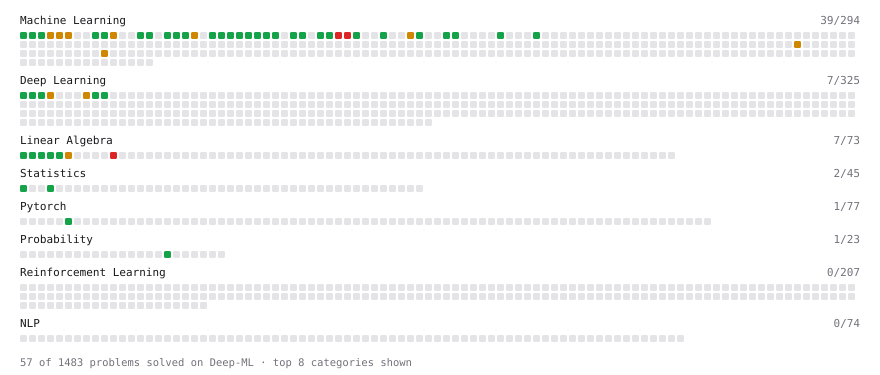

# Deep-ML

My machine learning practice from [Deep-ML](https://www.deep-ml.com). Every solution here was written by hand.

**51** solved · 51 problems · 0 labs · 0 math

[**Browse the interactive portfolio**](https://parulnegi.github.io/deep-ml/) to replay this filling in over time.

## Problems

| | Difficulty | Solved | |
| --- | --- | --- | --- |
| [Batch Iterator for Dataset](https://www.deep-ml.com/problems/30) | easy | 2025-08-09 | [solution](problems/0030-batch-iterator-for-dataset) |
| [Bhattacharyya Distance Between Two Distributions](https://www.deep-ml.com/problems/120) | easy | 2025-08-19 | [solution](problems/0120-bhattacharyya-distance-between-two-distributions) |
| [Binary Classification with Logistic Regression](https://www.deep-ml.com/problems/104) | easy | 2025-08-18 | [solution](problems/0104-binary-classification-with-logistic-regression) |
| [Build a Linear Regression Model with nn.Module](https://www.deep-ml.com/problems/885) | easy | 2026-08-11 | [solution](problems/0885-build-a-linear-regression-model-with-nn-module) |
| [Calculate Accuracy Score](https://www.deep-ml.com/problems/36) | easy | 2025-08-09 | [solution](problems/0036-calculate-accuracy-score) |
| [Calculate Covariance Matrix](https://www.deep-ml.com/problems/10) | easy | 2025-10-06 | [solution](problems/0010-calculate-covariance-matrix) |
| [Calculate Dice Score for Classification](https://www.deep-ml.com/problems/73) | easy | 2025-08-13 | [solution](problems/0073-calculate-dice-score-for-classification) |
| [Calculate F1 Score from Predicted and True Labels](https://www.deep-ml.com/problems/91) | easy | 2025-08-16 | [solution](problems/0091-calculate-f1-score-from-predicted-and-true-labels) |
| [Calculate Jaccard Index for Binary Classification](https://www.deep-ml.com/problems/72) | easy | 2025-08-13 | [solution](problems/0072-calculate-jaccard-index-for-binary-classification) |
| [Calculate Mean Absolute Error (MAE)](https://www.deep-ml.com/problems/93) | easy | 2025-08-14 | [solution](problems/0093-calculate-mean-absolute-error-mae) |
| [Calculate Mean by Row or Column](https://www.deep-ml.com/problems/4) | easy | 2025-08-05 | [solution](problems/0004-calculate-mean-by-row-or-column) |
| [Calculate R-squared for Regression Analysis](https://www.deep-ml.com/problems/69) | easy | 2025-08-13 | [solution](problems/0069-calculate-r-squared-for-regression-analysis) |
| [Calculate Root Mean Square Error (RMSE)](https://www.deep-ml.com/problems/71) | easy | 2025-08-13 | [solution](problems/0071-calculate-root-mean-square-error-rmse) |
| [Detect Overfitting or Underfitting](https://www.deep-ml.com/problems/86) | easy | 2025-08-14 | [solution](problems/0086-detect-overfitting-or-underfitting) |
| [Early Stopping Based on Validation Loss Plateau](https://www.deep-ml.com/problems/199) | easy | 2025-11-16 | [solution](problems/0199-early-stopping-based-on-validation-loss-plateau) |
| [ExponentialLR Learning Rate Scheduler](https://www.deep-ml.com/problems/154) | easy | 2025-08-20 | [solution](problems/0154-exponentiallr-learning-rate-scheduler) |
| [Feature Scaling Implementation](https://www.deep-ml.com/problems/16) | easy | 2025-08-06 | [solution](problems/0016-feature-scaling-implementation) |
| [Generate a Confusion Matrix for Binary Classification](https://www.deep-ml.com/problems/75) | easy | 2025-08-13 | [solution](problems/0075-generate-a-confusion-matrix-for-binary-classification) |
| [Gradient Checkpointing](https://www.deep-ml.com/problems/188) | easy | 2025-11-16 | [solution](problems/0188-gradient-checkpointing) |
| [Implement Early Stopping Based on Validation Loss](https://www.deep-ml.com/problems/135) | easy | 2025-08-21 | [solution](problems/0135-implement-early-stopping-based-on-validation-loss) |
| [Implement F-Score Calculation for Binary Classification](https://www.deep-ml.com/problems/61) | easy | 2025-08-10 | [solution](problems/0061-implement-f-score-calculation-for-binary-classification) |
| [Implement Gini Impurity Calculation for a Set of Classes](https://www.deep-ml.com/problems/64) | easy | 2025-08-10 | [solution](problems/0064-implement-gini-impurity-calculation-for-a-set-of-classes) |
| [Implement Precision Metric](https://www.deep-ml.com/problems/46) | easy | 2025-08-09 | [solution](problems/0046-implement-precision-metric) |
| [Implement Recall Metric in Binary Classification](https://www.deep-ml.com/problems/52) | easy | 2025-08-10 | [solution](problems/0052-implement-recall-metric-in-binary-classification) |
| [Implement ReLU Activation Function](https://www.deep-ml.com/problems/42) | easy | 2026-06-16 | [solution](problems/0042-implement-relu-activation-function) |
| [Implement Ridge Regression Loss Function](https://www.deep-ml.com/problems/43) | easy | 2025-08-09 | [solution](problems/0043-implement-ridge-regression-loss-function) |
| [Leaky ReLU Activation Function](https://www.deep-ml.com/problems/44) | easy | 2026-06-18 | [solution](problems/0044-leaky-relu-activation-function) |
| [Linear Kernel Function](https://www.deep-ml.com/problems/45) | easy | 2025-08-10 | [solution](problems/0045-linear-kernel-function) |
| [Linear Regression Using Gradient Descent](https://www.deep-ml.com/problems/15) | easy | 2025-07-06 | [solution](problems/0015-linear-regression-using-gradient-descent) |
| [Linear Regression Using Normal Equation](https://www.deep-ml.com/problems/14) | easy | 2025-07-06 | [solution](problems/0014-linear-regression-using-normal-equation) |
| [Matrix-Vector Dot Product](https://www.deep-ml.com/problems/1) | easy | 2025-08-05 | [solution](problems/0001-matrix-vector-dot-product) |
| [Measure Disorder in Apple Colors](https://www.deep-ml.com/problems/108) | easy | 2025-08-14 | [solution](problems/0108-measure-disorder-in-apple-colors) |
| [One-Hot Encoding of Nominal Values](https://www.deep-ml.com/problems/34) | easy | 2025-08-09 | [solution](problems/0034-one-hot-encoding-of-nominal-values) |
| [Random Shuffle of Dataset](https://www.deep-ml.com/problems/29) | easy | 2025-08-09 | [solution](problems/0029-random-shuffle-of-dataset) |
| [Reshape Matrix](https://www.deep-ml.com/problems/3) | easy | 2025-08-05 | [solution](problems/0003-reshape-matrix) |
| [Scalar Multiplication of a Matrix](https://www.deep-ml.com/problems/5) | easy | 2025-08-05 | [solution](problems/0005-scalar-multiplication-of-a-matrix) |
| [Shift and Scale Array to Target Range](https://www.deep-ml.com/problems/141) | easy | 2025-08-14 | [solution](problems/0141-shift-and-scale-array-to-target-range) |
| [Sigmoid Activation Function Understanding](https://www.deep-ml.com/problems/22) | easy | 2026-06-09 | [solution](problems/0022-sigmoid-activation-function-understanding) |
| [Single Neuron](https://www.deep-ml.com/problems/24) | easy | 2026-06-09 | [solution](problems/0024-single-neuron) |
| [Softmax Activation Function Implementation ](https://www.deep-ml.com/problems/23) | easy | 2026-06-09 | [solution](problems/0023-softmax-activation-function-implementation) |
| [StepLR Learning Rate Scheduler](https://www.deep-ml.com/problems/153) | easy | 2025-08-18 | [solution](problems/0153-steplr-learning-rate-scheduler) |
| [Transpose of a Matrix](https://www.deep-ml.com/problems/2) | easy | 2025-08-05 | [solution](problems/0002-transpose-of-a-matrix) |
| [Calculate Eigenvalues of a Matrix](https://www.deep-ml.com/problems/6) | medium | 2025-11-29 | [solution](problems/0006-calculate-eigenvalues-of-a-matrix) |
| [Divide Dataset Based on Feature Threshold](https://www.deep-ml.com/problems/31) | medium | 2025-08-21 | [solution](problems/0031-divide-dataset-based-on-feature-threshold) |
| [Implement Gradient Descent Variants with MSE Loss](https://www.deep-ml.com/problems/47) | medium | 2026-06-28 | [solution](problems/0047-implement-gradient-descent-variants-with-mse-loss) |
| [Implement K-Fold Cross-Validation](https://www.deep-ml.com/problems/18) | medium | 2025-08-18 | [solution](problems/0018-implement-k-fold-cross-validation) |
| [K-Means Clustering](https://www.deep-ml.com/problems/17) | medium | 2025-08-06 | [solution](problems/0017-k-means-clustering) |
| [Principal Component Analysis (PCA) Implementation](https://www.deep-ml.com/problems/19) | medium | 2025-08-20 | [solution](problems/0019-principal-component-analysis-pca-implementation) |
| [Simple Convolutional 2D Layer](https://www.deep-ml.com/problems/41) | medium | 2026-06-16 | [solution](problems/0041-simple-convolutional-2d-layer) |
| [Single Neuron with Backpropagation](https://www.deep-ml.com/problems/25) | medium | 2026-06-09 | [solution](problems/0025-single-neuron-with-backpropagation) |
| [Singular Value Decomposition (SVD) of 2x2 Matrix](https://www.deep-ml.com/problems/12) | hard | 2026-03-03 | [solution](problems/0012-singular-value-decomposition-svd-of-2x2-matrix) |

---

_This file is regenerated by Deep-ML on every push._
